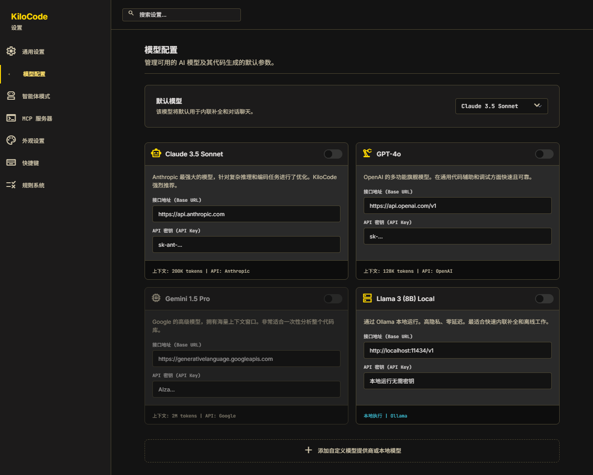

# KiloCode Desktop

**Windows-first desktop workspace for AI-assisted software development.**

[中文](#中文) · [English](#english)

> **Developer Preview · v0.8.0-dev.1**
>
> KiloCode Desktop is an Electron application that brings KiloCode's agent workflow into a focused desktop workspace. It combines chat, model configuration, project context, terminal access, browser control, diffs, MCP tools, permissions, and system-level desktop integration in one application.



## 中文

### 项目简介

KiloCode Desktop 是面向 Windows 的 AI 编程工作台。它以 Electron 为桌面容器，以 React + TypeScript 构建界面，并通过 KiloCode CLI 提供 AI Agent 的运行能力。

项目目前处于开发预览阶段，适合体验界面、验证桌面交互和参与功能开发。完整 AI 能力需要连接可用的 KiloCode CLI 或后端服务；未连接时，应用会进入模拟模式，用于浏览和演示主要界面。

### 核心能力

- **Agent 工作流**：Code、Plan、Ask、Debug、Review 五种内置模式，以及自定义模式
- **模型与提供商管理**：模型目录、默认模型、API 配置、自定义端点和本地模型入口
- **流式对话**：Markdown 渲染、代码高亮、工具调用展示、会话管理和会话分叉
- **开发工具集成**：集成终端、文件树、Diff 查看器和项目/工作区上下文
- **浏览器控制**：页面导航、截图、交互操作、无障碍树和 JavaScript 控制台
- **MCP 与权限**：MCP 服务器管理、启用/禁用控制、默认策略和逐工具权限确认
- **工程辅助**：规则系统、记忆库、Token 用量统计、文件上传、内联补全和语音输入
- **桌面体验**：深色/浅色/跟随系统主题、系统托盘、快捷键、状态持久化和崩溃恢复

### 界面预览

当前版本提供 Codex 风格的三栏工作区：左侧管理模式、模型、会话和项目，中间进行对话，右侧承载终端、Diff、浏览器、文件和记忆工具。

### 环境要求

- Windows 10 或 Windows 11（x64）
- Node.js 18 或更高版本（仅开发和构建需要）
- npm 9 或更高版本（仅开发和构建需要）
- KiloCode CLI 或兼容后端服务（运行完整 AI 功能需要）

### 快速开始

```bash
git clone https://github.com/realhenrylan/kilocode-app.git
cd kilocode-app
npm install
npm run electron:dev
```

浏览器预览模式：

```bash
npm run dev
```

浏览器预览用于查看前端界面；需要验证窗口、托盘、快捷键和桌面生命周期时，请使用 `npm run electron:dev`。

### 构建与质量检查

```bash
# TypeScript + Vite 生产构建
npm run build

# 静态检查
npm run lint

# 构建 Windows 安装包
npm run electron:build
```

安装包默认输出到 `release/`。如果 Electron 或安装包进程仍在运行，Windows 可能锁定输出目录；重新构建前请先退出相关进程。

### 项目结构

```text
kilocode-app/
├── electron/              # Electron 主进程、预加载、IPC、托盘和快捷键
├── src/                   # React 前端、组件、状态、服务和样式
├── public/                # 前端静态资源
├── resources/             # Windows 应用和托盘图标资源
├── scripts/               # 开发和构建辅助脚本
├── electron-builder.yml   # Windows 打包配置
├── CHANGELOG.md           # 版本变更记录
├── SPEC.md                # 项目规格文档
└── PROGRESS.md            # 当前进度与交接记录
```

### 技术栈

| 层级 | 技术 |
| --- | --- |
| 桌面框架 | Electron 43 |
| 前端 | React 19 + TypeScript |
| 构建 | Vite 8 + electron-builder |
| UI | Radix UI + Tailwind CSS v4 |
| 状态管理 | Zustand 5 |
| 代码高亮 | Shiki |
| 终端 | `@xterm/xterm` |
| 后端通信 | HTTP REST + SSE |

### 相关文档

- [项目规格](./SPEC.md)
- [当前进度](./PROGRESS.md)
- [变更日志](./CHANGELOG.md)
- [设计文档](./DESIGN.md)

### 许可证

本项目采用 [MIT License](./LICENSE)。

## English

### Overview

KiloCode Desktop is a Windows-first AI coding workspace. It uses Electron as the desktop shell, React + TypeScript for the UI, and the KiloCode CLI as the runtime for AI agent capabilities.

This project is currently a developer preview. It is intended for exploring the desktop experience, validating native integrations, and contributing to the implementation. A working KiloCode CLI or compatible backend is required for full AI functionality. Without one, the application falls back to simulation mode so the main interface can still be explored and demonstrated.

### Highlights

- **Agent workflows**: Code, Plan, Ask, Debug, and Review modes, plus custom modes
- **Model and provider management**: model catalog, defaults, API configuration, custom endpoints, and local model entry points
- **Streaming conversations**: Markdown rendering, syntax highlighting, tool-call cards, session management, and session branching
- **Developer tools**: integrated terminal, file tree, Diff viewer, and project/workspace context
- **Browser control**: navigation, screenshots, interaction actions, accessibility tree, and JavaScript console
- **MCP and permissions**: MCP server management, enable/disable controls, default policies, and per-tool confirmation
- **Engineering assistance**: rules, memory, token usage, file uploads, inline completion, and voice input
- **Desktop integration**: dark/light/system themes, system tray, shortcuts, persisted state, and crash recovery

### Requirements

- Windows 10 or Windows 11 (x64)
- Node.js 18 or later for development and builds
- npm 9 or later for development and builds
- KiloCode CLI or a compatible backend service for full AI functionality

### Quick start

```bash
git clone https://github.com/realhenrylan/kilocode-app.git
cd kilocode-app
npm install
npm run electron:dev
```

For a browser-only preview:

```bash
npm run dev
```

The browser preview is useful for inspecting the renderer. Use `npm run electron:dev` to validate the native window, tray, shortcuts, and desktop lifecycle.

### Build and checks

```bash
# TypeScript and Vite production build
npm run build

# Static analysis
npm run lint

# Build the Windows installer
npm run electron:build
```

The installer is written to `release/` by default. Windows may lock the output directory while Electron or an installer process is running; exit those processes before rebuilding.

### Architecture

| Layer | Responsibility |
| --- | --- |
| Electron main process | Window lifecycle, CLI process, IPC, tray, shortcuts, and recovery |
| Preload | Secure `contextBridge` APIs exposed to the renderer |
| React renderer | Workspace UI, chat, settings, tools, and interaction flows |
| Zustand stores | Sessions, configuration, connection, UI, browser, memory, index, usage, and rules |
| Services | KiloCode REST client and SSE event stream |

### Repository layout

```text
kilocode-app/
├── electron/              # Main process, preload, IPC, tray, and shortcuts
├── src/                   # React UI, components, state, services, and styles
├── public/                # Renderer assets
├── resources/             # Windows application and tray icon assets
├── scripts/               # Development and build helpers
├── electron-builder.yml   # Windows packaging configuration
├── CHANGELOG.md           # Release history
├── SPEC.md                # Project specification
└── PROGRESS.md            # Project status and handoff notes
```

### Documentation

- [Project specification](./SPEC.md)
- [Current progress](./PROGRESS.md)
- [Changelog](./CHANGELOG.md)
- [Design documentation](./DESIGN.md)

### License

This project is released under the [MIT License](./LICENSE).
